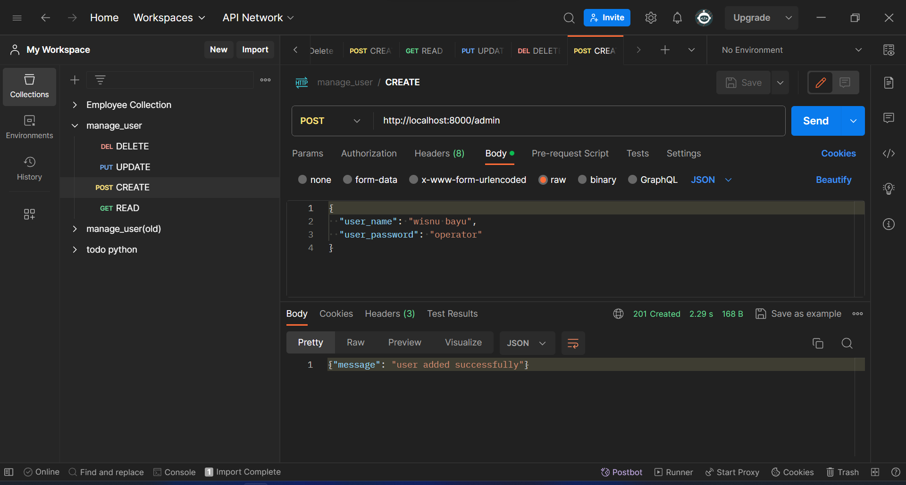
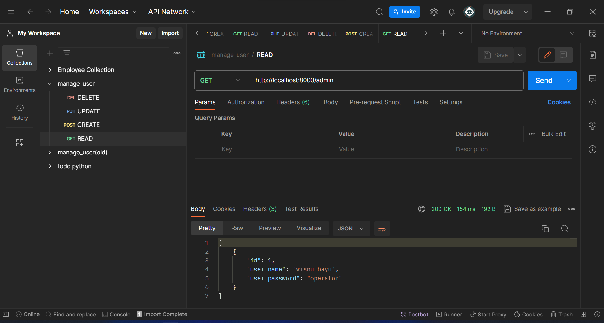
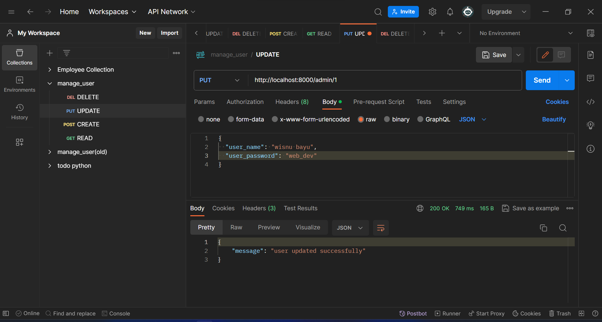
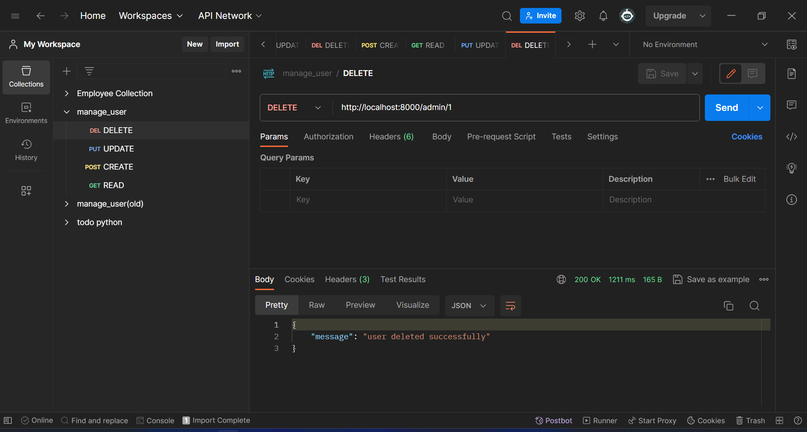
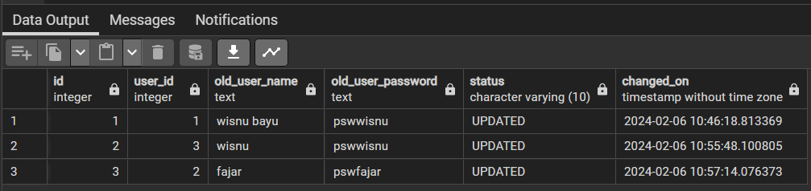

# UAS Microservice CRUD API PLSQL UNSIA

Mata Kuliah : Pemrograman PL/SQL

Kelas : IT302

Prodi : PJJ Informatika

Dosen : Abdul Azzam Ajhari, S.Kom., M.Kom

Anggota Kelompok :

-   Wisnu Bayu Aji Fajar Nugroho (220401010079)
-   Yummiarna (220401020018)
-   Yohanes Almandaru Tommy Prihatin (220401010110)

# Microservice CRUD API with Python and PostgreSQL

## Dokumentasi berdasarkan SDLC Waterfall

### 1. ANALISIS KEBUTUHAN

-   Tujuan: Sistem ini bertujuan untuk mengelola pengguna dengan operasi CRUD (Create, Read, Update, Delete) Python, PostgreSQL, enkripsi AES128, dan Datalog.

-   Fitur:

    -   Pendaftaran user
    -   Manajemen profil user
    -   CRUD data user
    -   Riwayat aktivitas user
    -   Otentikasi dan otorisasi
    -   Enkripsi data user

-   Persyaratan:

    -   Python 3.8 atau lebih tinggi
    -   PostgreSQL 12 atau lebih tinggi
    -   Postman
    -   Python Library untuk PostgreSQL (psycopg2)
    -   Python extension untuk enkripsi AES128 (pgcrypto)
    -   Datalog engine (Datalog-Python)

-   Batasan:

    -   Sistem ini tidak mendukung multi-tenancy.
    -   Sistem ini tidak mendukung integrasi dengan layanan pihak ketiga

### 2. DESIGN

-   Sistem akan terdiri dari beberapa microservice:

    -   Microservice Pendaftaran (Insert): Menambahkan user baaru
    -   Microservice Autentikasi: Manajemen otorisasi (password)
    -   Microservice Manajemen Profil: Mengelola profil pengguna.
    -   Microservice CRUD Data Pengguna: Menangani operasi CRUD pada data pengguna.
    -   Microservice Riwayat Aktivitas: Mencatat riwayat aktivitas pengguna.

-   Setiap microservice akan terhubung ke database PostgreSQL.

-   Data pengguna akan dienkripsi dengan AES128 sebelum disimpan di database.

-   Datalog akan digunakan untuk melacak perubahan data pengguna.

### 3. IMPLEMENTASI

-   Persiapan:

    -   Pastikan Python dan PostgreSQL sudah terinstal di sistem Anda.
    -   Unduh kode program untuk microservice CRUD.

-   Instalasi Dependensi:

    -   Buka terminal atau command prompt.
    -   Jalankan perintah pip install psycopg2 untuk menginstal driver PostgreSQL.
    -   Jalankan perintah pip install python-dotenv untuk menginstal modul python-dotenv yang diperlukan untuk mengelola variabel environment.

-   Persiapan Database:

    -   Buka pgAdmin (GUI untuk PostgreSQL).
    -   Buat sebuah database baru dengan nama users.
    -   Buka perangkat psql di dalam database users.
    -   Jalankan perintah CREATE EXTENSION pgcrypto; untuk menginstal ekstensi pgcrypto, yang diperlukan untuk enkripsi.
    -   Buka perangkat query di dalam database users.
    -   Eksekusi skrip user.sql untuk membuat tabel data_user, fungsi enkripsi AES256, dan fungsi trigger untuk log data.

-   Konfigurasi Environment:

    -   Buka file .env.example.
    -   Sesuaikan nilai variabel di dalamnya seperti kredensial login ser manager API dan database.
    -   Simpan file tersebut dengan nama .env.

-   Menjalankan Program User Manager API:

    -   Buka terminal atau command prompt.
    -   Navigasi ke direktori tempat kode program berada.
    -   Jalankan server dengan menjalankan perintah python main.py.

-   Interaksi dengan API:

    -   Gunakan Postman atau perangkat lunak serupa untuk berinteraksi dengan API.
    -   Untuk mempermudah, Anda dapat mengimpor koleksi (collection) yang disediakan dalam file collection_manage_user.json ke Postman.

### 4. PENGUJIAN

Pengujian menggunakan Postman

#### A. CREATE

Microservice Pendaftara Data Pengguna:

-   Insert data
-   Memvalidasi new data
-   Menyimpan data users di database PostgreSQL dengan enkripsi AES128.

#### B. READ

Microservice Read Data Pengguna:

-   Menangani operasi Read pada data pengguna.
-   Memverifikasi kredensial pengguna, sebelum memberikan data

#### C. UPDATE

Microservice Read Data Pengguna:

-   Menangani operasi Read pada data pengguna.
-   Memverifikasi kredensial pengguna, sebelum memberikan data

#### D. DELETE

Microservice Delete Data Pengguna:

-   Menangani operasi Delete pada data pengguna.
-   Memvalidasi data pengguna.
-   Menyimpan data pengguna di database PostgreSQL dengan enkripsi AES128.
-   Mencatat riwayat perubahan data di Datalog.

Contoh Pengaplikasian Enkripsi AES256
(Pengujian database pada PostgreSQL)

#### E. TANPA PASSWORD

Apabila user login tanpa menggunakan password. sData terenkripsi dan tidak bisa dilihat

#### F. DENGAN PASSWORD

Apabila user login menggunakan password. Data akan bisa dilihat

#### G. DATALOG

Microservice Riwayat Aktivitas:

-   Mencatat riwayat aktivitas pengguna.
-   Menyimpan riwayat aktivitas di database PostgreSQL

### 5. PEMELIHARAAN

-   Sistem akan dipantau secara berkala untuk memastikan performanya.
-   Bug dan masalah akan diperbaiki sesegera mungkin.
-   Fitur baru akan ditambahkan sesuai kebutuhan.
